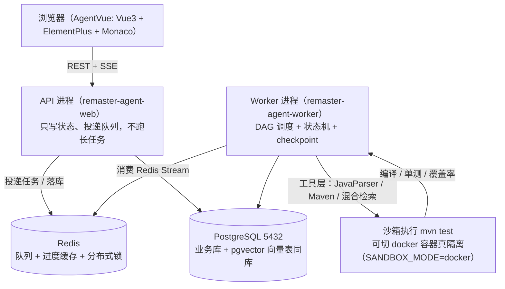
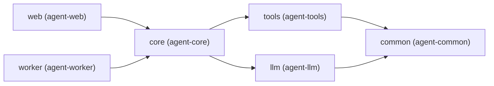

# RemasterAgent

> 给遗留 Java 系统做一次**可验证的重制** —— 业务逻辑一行不动，只把技术栈提上去。

母带重制（remaster）这个隐喻就是这个项目在做的事：原来的演奏一个音都不改，只把母版质量提上去。翻译到代码上就是 —— **不重写业务，只做可验证的现代化**。

## 它和别的 AI 改代码工具有什么不同

大多数「AI 改代码」停在「让模型输出一段新代码」这一步。难点从来不在生成，而在**你怎么知道它改对了**。

RemasterAgent 把重心放在后半段：

- **结果客观可验证**：迁移动不动得成，由沙箱里真实的 `mvn test` + JaCoCo 说了算，不是模型说自己对了
- **失败会回退**：编译或单测不过，把失败日志喂回去让它重写，`attempt` 递增，超过上限就向上冒泡失败 —— 不无限烧钱
- **长任务可中断可续跑**：状态机 + checkpoint 落 PostgreSQL，进程被杀了重启能接着跑
- **代码理解靠 JVM 工具链**：JavaParser 建 AST、ASM 读字节码、Maven Resolver 解依赖树，而不是把源码丢给模型让它自己猜

## 架构速览



完整设计见 [`docs/ARCHITECTURE.md`](docs/ARCHITECTURE.md)。编码约定与命令见 [`AGENTS.md`](AGENTS.md)。

## 目录结构

```
AgentServer/   后端（Maven 多模块，JDK 21 + Spring Boot 3 + LangChain4j）
AgentVue/      前端（Vue3 + TypeScript + Vite + ElementPlus）
examples/      被迁移的示例工程，用于端到端验证
docs/          架构与设计文档
```

Maven 模块与依赖方向（单向，不允许反向依赖）：



`remaster-agent-core` **刻意不依赖 Spring Web** —— 编排逻辑（DAG 调度、状态机、回退）必须能脱离容器纯单测。

## 快速开始

> ⚠️ 本机 Maven 必须在 PowerShell 或直接调用 `mvn.cmd`，在 Git Bash 里跑 `mvn` 会因 Windows 路径翻译问题报 `ClassNotFoundException`。

```bash
# 1. 复制配置并填入真实值
cp .env.example .env

# 2. 编译
cd AgentServer
"E:/buildTools/apache-maven-3.9.16/bin/mvn.cmd" -B \
  -s "E:/buildTools/apache-maven-3.9.16/conf/settings.xml" \
  -Dmaven.repo.local=E:/java/maven/localStorage \
  compile

# 3. 建库（幂等）
# 见 AGENTS.md 的「建库与迁移」一节

# 4. 启动（开发模式，Worker 内嵌在 API 进程里）
"E:/buildTools/apache-maven-3.9.16/bin/mvn.cmd" -pl remaster-agent-web spring-boot:run
```

## 安全须知

1. **凭据一律不进版本库。** 数据库口令、Redis 口令、模型 API Key 全部写在 `.env`（已 gitignore），仓库里只留 `.env.example` 占位模板。
2. **本地沙箱没有真正的隔离。** 当前 `SANDBOX_MODE=local` 是用本机受限子进程执行 LLM 生成的代码 —— 它能限超时、限内存、限工作目录，但**不能限制文件系统与网络访问**。所以现阶段只对 `examples/` 下的自有可信工程执行，不要指向来路不明的仓库。装好 Docker 后切 `SANDBOX_MODE=docker` 即可获得真正的隔离，上层代码无需改动。

## 当前进度

- **阶段 1（最小闭环）**：单文件改写 → 沙箱 `mvn test` 编译/单测验证 → 失败回退重写（attempt 递增，上限 3 轮）。
- **阶段 2（DAG 规划 + 人工评审）**：PLAN 节点运行期插入 rewrite/verify 链；人工评审门控（`plan_approved`）。
- **阶段 3（交付层 + 可观测）**：多节点拓扑、全链路 Trace、SSE 进度、回写预检/备份、**成本治理**（按任务 token 成本 + 重试上限封顶）。
- **阶段 4（整仓升级 + 评测集）**：`entryFile` 留空＝整仓升级（POM_REWRITE→VERIFY，零模型成本）；评测集 33 条 / 31 就绪 / 14 工程。
- **阶段 5（多文件迁移收敛 + 框架破坏性 API 治理，已端到端验证）**：
  - **批语义**：多文件 REWRITE + 单条整仓 VERIFY，失败**精准重跑**（只重跑仍含旧 import 的文件，干净文件跳过，杜绝 `+0/-0` 死循环）。
  - **迁移质量护栏**：`LegacyImportDetector` 改写后残留旧 import 校验；PLAN 三层安全网（`JdkRemovalScanner` + `LegacyImportDetector` + `Spring3BreakingApiScanner`）绕开 `MAX_PLAN_FILES` 做覆盖率兜底。
  - **依赖与父 POM 升级**：`POM_REWRITE`（编译级别）、`PARENT_UPGRADE`（SB3 parent）、`DEPENDENCY_UPGRADE`（`JakartaArtifactCatalog` 注入 jakarta 依赖、`SpringBoot3DependencyCatalog` 注入 httpclient5 等）。
  - **失败原因不再撒谎**：`finalizeTask` 跳过 PENDING 节点，暴露真实编译错误。
  - 里程碑：博客工程（SB2.7 + Java 8，125 文件 / 43 用 javax）端到端 **SUCCEEDED** —— 44 文件改写、整仓 VERIFY 一次通过、零残留 javax。

**已知缺口（P1，尚未实现）**：负样本 api-leak 护栏、整仓分片迁移、SDK 升级规则面拓宽（Hibernate5→6 / Security5→6）。

**已落地（基础版）**：上下文治理 —— `remaster.llm.context.*` 配置「相关代码」的 token 预算（`max-tokens` / `enabled`），改写前过 `ContextCurator`：按正文去重、按 RRF 排名重排、超预算从低优先级裁剪、源文件永远在场、每次调用打印「预算/入选/丢弃/估算使用/溢出」可观测日志。把原先硬编码的 12k 字符上限升级为可配置、按 token 计量、可观测的输入侧预算。
